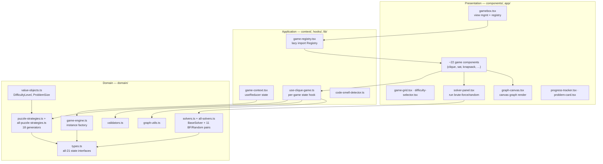

# Code Graph & Architecture: `v0-np-complete-gamebox`

> Analysis of [kennbyee25/v0-np-complete-gamebox](https://github.com/kennbyee25/v0-np-complete-gamebox)
> — an earlier, related project. Captured so we can port its best ideas into
> `pack-it-play-it`. See [v0-gamebox-inventory.md](./v0-gamebox-inventory.md) for the
> feature/principle list and [v0-integration-backlog.md](./v0-integration-backlog.md) for
> the prioritized port plan.

## TL;DR

A **Next.js** educational gamebox for **Karp's 21 NP-complete problems**, built with an
explicit **Domain-Driven Design** layering and a heavy emphasis on **SOLID / TDD / code-smell
refactoring**. ~19k LOC, **226 tests**, a single (squashed `v0` export) commit — so there is
no diff-by-diff history to walk; the value is in the *code and its docs*, not the commit log.

Where `pack-it-play-it` (pip) is lean (4 games, one `PuzzleGame` contract, SVG renderers),
v0 is broad and formal: **~18 puzzle generators**, **~11 brute-force + random solver pairs**,
separate validators, value objects, and a documented engineering methodology.

## Layered architecture (DDD)



**Dependency rule** (respected): Presentation → Application → Domain. The domain has no React
imports; UI depends on domain abstractions, not the reverse (Dependency Inversion).

## The two core abstractions

### 1. `PuzzleStrategy<T>` — generation (Strategy + Registry)
`domain/puzzle-strategies.ts`
```ts
interface PuzzleStrategy<T> {
  generate(difficulty: Difficulty): T;
  validate(state: T): boolean;
  calculateScore?(state: T): number;
}
// registry + getStrategy(type) + registerStrategy(type, strategy)  // Open/Closed
```
Difficulty is a **4-tier enum** (`easy|medium|hard|expert`) mapped through a
`DIFFICULTY_CONFIG { multiplier, baseSize }` constant (fixes "magic numbers"). The 18
generators in `all-puzzle-strategies.ts` are plain functions (`generateCliqueGraph`,
`generateMaxCut`, …) plus graph helpers (`generateRandomGraph(vertexCount, density)`).

### 2. `Solver<T,P>` — solving (Template Method + Factory)
`domain/solvers.ts`
```ts
interface SolverResult<T> { solved: boolean; solution: T|null; iterations: number; timeMs: number; metadata?: ... }
interface Solver<T,P> { solve(puzzle,params?): SolverResult<T>; getName(): string; getType(): 'brute-force'|'random'; }
abstract class BaseSolver { // Template Method: owns timing + iteration/timeout budget
  solve() { ...doSolve(puzzle, params, { incrementIterations, checkTimeout }) }
  protected abstract doSolve(...): ...;
}
// getSolvers(type) -> { bruteForce, random }   // Factory
```
Every problem ships **two interchangeable solvers** (Liskov): an exhaustive **brute force**
(bitmask subsets / backtracking / combination enumeration) and a **random** heuristic, both
bounded by `maxIterations` (default 10000) and `timeoutMs` (default 5000) so the UI never
hangs on an NP-hard instance.

## Notable structural facts

- **`types.ts`** declares typed state for *all 21* problems (graph/SAT/knapsack/subset-sum/
  set/3D-matching/job-sequencing/QAP/steiner/feedback…), with `readonly` everywhere
  (immutability) and metadata fields `category` (`satisfiability|graph|set|number|sequencing`),
  `yearIntroduced`, and **`reductionFrom?: ProblemId`** — an explicit nod to Karp reductions.
- **`game-registry.tsx`** lazy-imports each of the 23 game components (`() => import(...)`),
  keyed by `ProblemId` — a Registry that also code-splits the bundle.
- **`value-objects.ts`** wraps primitives: `DifficultyLevel` encapsulates
  `{ vertexCount, density, scale }` per tier; `ProblemSize` derives sizes — killing
  "primitive obsession" and scattering of `difficulty === 'easy' ? 3 : …`.
- **`solver-panel.tsx`** is a generic `<SolverPanel<T>>` with `onRunBruteForce`,
  `onRunRandom`, `onApplySolution` — reused across games to expose the solvers in the UI and
  show `iterations` / `timeMs`.
- **`lib/code-smell-detector.ts`** enumerates 8 smell types (long-method, large-class,
  feature-envy, data-clumps, primitive-obsession, switch-statements, duplicate-code,
  magic-numbers) and documents where each was found/fixed.
- **`__tests__/`** mirrors the layers: `domain/` (strategies, solvers, validators,
  value-objects, graph-utils, engine), `hooks/`, `components/`, `integration/` — 226 tests,
  written test-first.

## How this maps onto pip (quick orientation)

| v0 concept | pip equivalent today | gap |
|---|---|---|
| `PuzzleStrategy.generate/validate` | `PuzzleGame.generate/isSolved` | pip's contract also has `applyMove`/`progress`; v0 lacks per-move model |
| `DIFFICULTY_CONFIG` (4 tiers) | continuous numeric difficulty (`DIFFICULTY`) | pip's is finer; v0's value objects are a cleaner encapsulation pattern |
| `Solver` + brute-force/random | **none** | pip has no solver layer — biggest gap, highest synergy |
| `validators.ts` | inline `isSolved` per game | pip is fine; v0 is more SRP-separated |
| 18 generators | 4 games | pip's Karp-21 breadth-fill can lift these |
| `reductionFrom`/`category` metadata | none | directly supports pip's transfer thesis (MVP3) |
| Code-smell catalog + SOLID/TDD docs | red-green-refactor convention | formalize as `docs/PRINCIPLES.md` |

The port plan lives in [v0-integration-backlog.md](./v0-integration-backlog.md).
