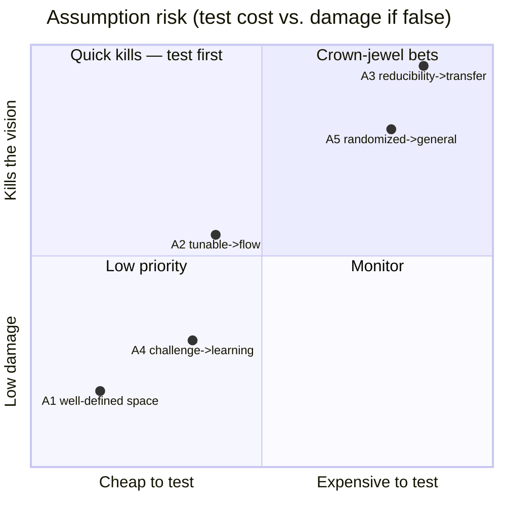
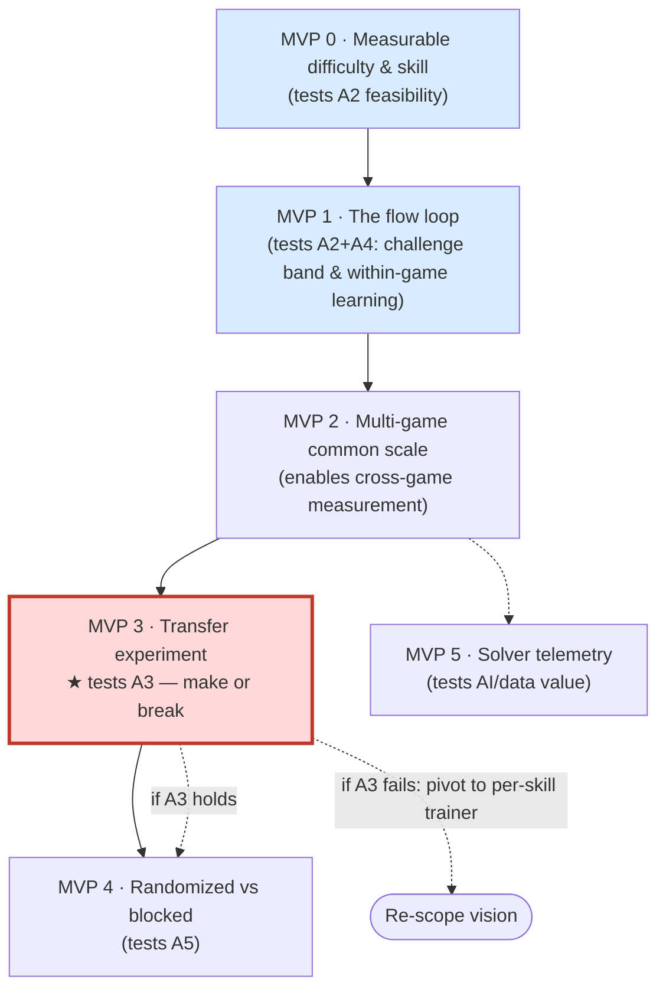
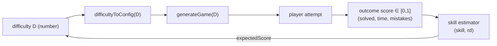
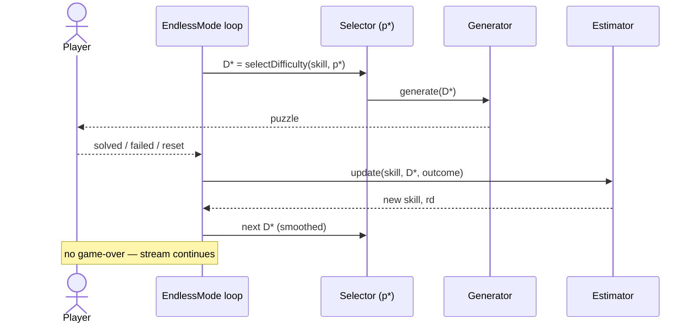
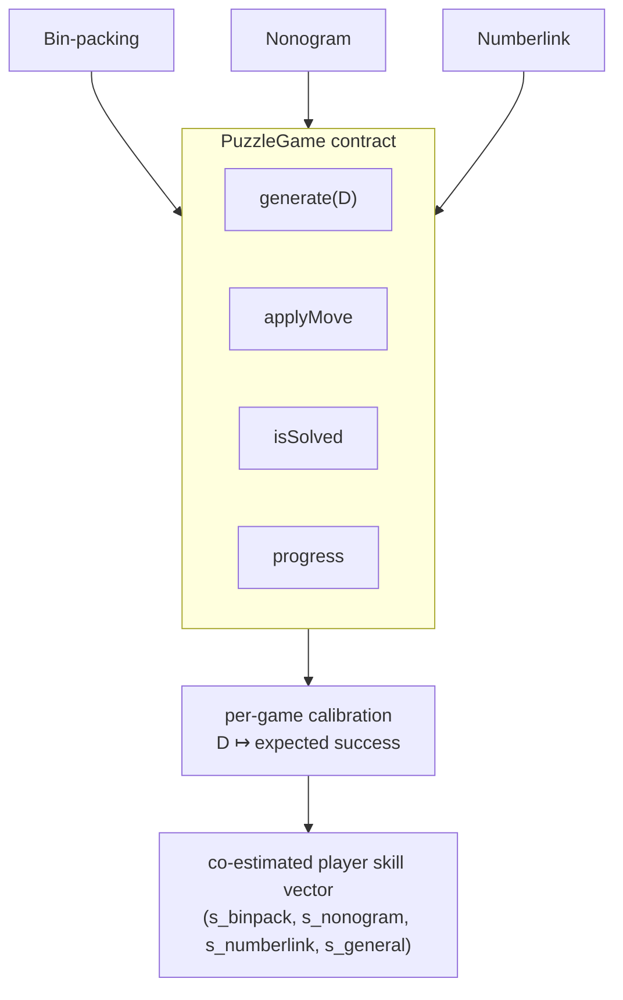
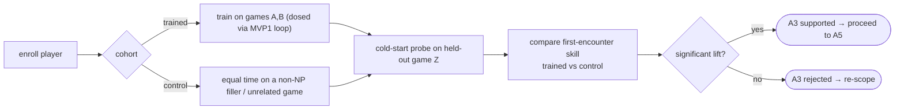
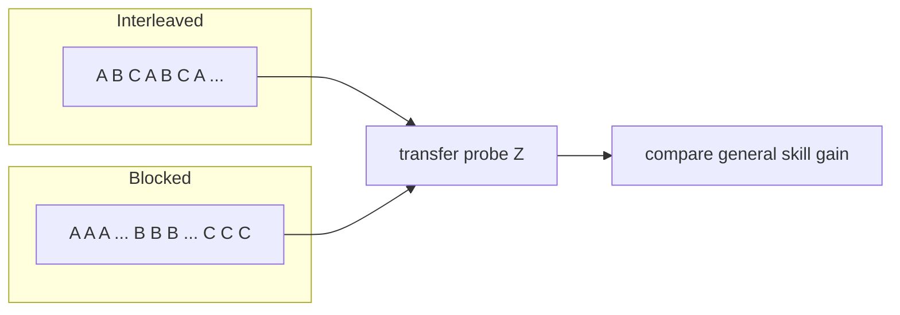
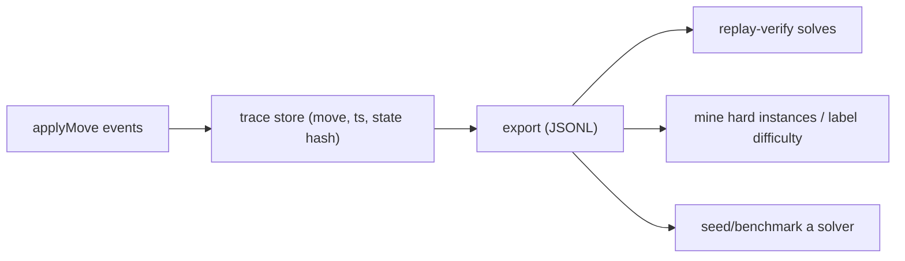

# Vision & MVP Roadmap: An NP-Complete Training Platform

## Vision

A platform where a single substrate — **NP-complete puzzles** — serves three audiences at once:

1. **Humans** play to train their brains. They load the app and are fed a stream of
   randomized puzzles tuned to their skill, getting better not just at each game but
   at *well-defined problem-solving as a whole*.
2. **Algorithms** are tested and benchmarked against a broad, principled battery of
   hard problems.
3. **AI** is trained and evaluated on NP-complete solving, fueled by the human
   solution traces the platform collects.

The long bet: a person who trains here improves on a *general* cognitive skill, and
the data exhaust simultaneously advances the state of NP-complete solvers.

## The assumptions this vision rests on

The vision is a stack of five literature-derived assumptions. The platform only
works if they hold *in combination*.

| # | Assumption | Source family |
|---|------------|---------------|
| A1 | NP-complete is a well-defined, rich, *interesting* space to draw games from. | Complexity theory (Karp, Garey & Johnson) |
| A2 | The built-in tunable complexity lets us hit *optimal challenge* and put a player in flow. | Flow theory; Dynamic Difficulty Adjustment |
| A3 | The **reducibility** of NP-complete problems implies human **skill transfers/generalizes** across them. | Karp reductions ⟶ (claimed) cognitive transfer |
| A4 | Learning is optimal under *proper* (matched) challenge. | Zone of Proximal Development; desirable difficulty |
| A5 | *General* learning is optimal under *randomized/interleaved* games. | Interleaved & varied practice |

## Risk analysis — which are leaps of faith?

We score each on **P(false)** × **Impact if false** × how **cheap/early** it is to test.
"Impact" is how much of the vision collapses if the assumption is wrong.

**Verdict:**

- **A1** is essentially settled — complexity theory defines the space, and our existing
  bin-packing game already proves an NP-complete instance is playable and interesting.
  *Not a bet.*
- **A4** is well-supported by decades of education research. *Low risk; we rely on it.*
- **A2 (tunable complexity → flow)** is a **medium technical bet**. The hidden risk
  isn't flow theory — it's whether we can *parameterize a generator so difficulty is
  monotonic with, and predictive of, real player success.* If the knob doesn't map to
  perceived difficulty, adaptivity is impossible. Cheap-ish to test.
- **A5 (randomized → general learning)** is a **high bet**. Interleaving helps *within a
  domain*; that it maximizes *cross-domain general* skill on NP-complete games is an
  extrapolation.
- **A3 (reducibility → human transfer)** is the **single highest-risk leap and the crown
  jewel.** Polynomial-time reductions are *formal, computational* relationships between
  problems; there is no established result that they predict *human cognitive* skill
  transfer. If A3 is false, the platform's central promise ("get better at all
  well-defined skills") collapses to "get better at each game you grind." Everything
  unique about the vision lives or dies here.

### The two conclusions to attack first

1. **A3 — does skill transfer across NP-complete games?** (Crown jewel.)
2. **A5 — does randomized interleaving beat blocked practice for general skill?**
   (Closely coupled to A3; same experimental machinery.)

Plus the enabling technical bet **A2** — without controllable difficulty + a valid
skill estimate we cannot *measure* A3/A5 at all.

## De-risking strategy

We cannot test A3 (transfer) until we have: (a) ≥2 games, (b) a per-player skill
estimate, (c) controllable difficulty so practice is dosed and comparable. So
build-order ≠ risk-order. We build the **minimum instrumentation** (MVP 0–2) needed to
run the **make-or-break transfer experiment (MVP 3)** — and keep that scaffolding
deliberately thin, because if MVP 3 fails the vision pivots hard.

Each MVP below states the **bet**, a **falsifiable kill criterion**, the **architecture**,
and **Given/When/Then** user stories that become the TDD test suite. The Given/When/Then
prose *is* the spec — each maps to a test file as we did for the bin-packing engine.

---

## MVP 0 — Measurable Difficulty & Skill

**Bet (A2 feasibility):** A single NP-complete game can be parameterized so difficulty
is *monotonic* with player success, and we can estimate player skill on a stable scale
that *predicts the next puzzle's outcome better than chance*.

**Kill criterion:** If the difficulty parameter does not correlate monotonically with
empirical success rate (Spearman ρ < 0.7 in simulation/pilot), or the skill estimate
does not beat a naive baseline at predicting outcomes, then "tunable complexity" is
unsupported for this game — fix the generator or the metric before building anything else.

**Scope (reuses existing code):** Generalize `generateGame` (`src/utils/puzzleGenerator.ts`)
to a numeric difficulty `D` via `difficultyToConfig(D)` (per the
[adaptive-mode plan](./infinite-adaptive-mode.md)); add a Glicko/Elo-lite skill estimator;
add an outcome scorer.

### Stories → TDD cases

- **Monotonic difficulty**
  *Given* a fixed simulated solver of constant ability,
  *When* it attempts puzzles across the full range of `D`,
  *Then* its empirical success rate is (weakly) monotonically decreasing in `D`.
- **Skill estimate converges**
  *Given* a simulated player of fixed true skill,
  *When* they play N puzzles selected around their estimate,
  *Then* the estimate converges to true skill within tolerance and its deviation (rd) shrinks.
- **Predicts outcomes**
  *Given* a calibrated skill estimate and a puzzle of rating `D`,
  *When* we compute `expectedScore(skill, D)`,
  *Then* it predicts realized success better than a fixed 0.5 baseline (lower log-loss).
- **Difficulty inversion**
  *Given* a target success probability `p*`,
  *When* we solve for `D*`,
  *Then* `expectedScore(skill, D*) ≈ p*` within ε.

---

## MVP 1 — The Flow Loop

**Bet (A2 + A4):** Adaptive puzzle selection keeps players inside a target success
("flow") band, *and* players show within-game learning (skill rises with play).

**Kill criterion:** Realized success rate fails to converge to the target band, or no
positive learning slope emerges across a session → adaptivity doesn't produce the
intended challenge experience.

**Scope:** The endless single-game session — `EndlessMode.tsx` wrapping the existing
`BinPackingGame`, wiring MVP 0's estimator + selector into a no-game-over loop, with
guardrails (max difficulty step, hysteresis) and `localStorage` persistence.

### Stories → TDD cases

- **Endless stream**
  *Given* a player finishes a puzzle, *When* the outcome is recorded, *Then* a new
  puzzle is presented with no game-over screen.
- **Stays in the band**
  *Given* a simulated player over ≥30 puzzles, *When* the loop runs, *Then* the moving
  success rate settles within ±10% of `p*`.
- **Smoothing guardrail**
  *Given* a single fluke failure, *When* the next difficulty is chosen, *Then* `D` moves
  by no more than the max step (no lurch).
- **Session persists**
  *Given* a player closes and reopens, *When* `EndlessMode` mounts, *Then* skill/rd are
  restored from storage.
- **Within-game learning**
  *Given* a simulated learner whose true skill rises, *When* they play a long session,
  *Then* served `D` trends upward while success stays near `p*`.

---

## MVP 2 — Multi-Game Common Scale

**Bet (enabler):** Multiple NP-complete games can share one **normalized** difficulty/skill
scale, so a player's skills across games are co-estimable and comparable — the
precondition for measuring transfer.

**Kill criterion:** Per-game difficulty ratings can't be normalized to a common success
semantics (same `D` ⇒ wildly different success across games even after calibration) →
cross-game comparison is invalid; transfer can't be cleanly measured.

**Scope:** Implement the `PuzzleGame` engine from the
[NP-complete games plan](./np-complete-games.md) and add 2 more games (recommend
**Nonograms** and **Numberlink**). Calibrate each game's `difficultyToConfig` so a given
`D` yields the same expected success for a reference skill.

### Stories → TDD cases

- **Engine conformance**
  *Given* any registered game, *When* `generate(D)` is solved by its own solution,
  *Then* `isSolved` is true and a freshly stripped instance is not solved. (Run as a
  shared parameterized suite over every game.)
- **Calibrated equivalence**
  *Given* the reference skill and a fixed `D`, *When* a reference solver plays each game,
  *Then* success rates across games agree within tolerance.
- **Per-game skill independence**
  *Given* a player strong at game A and weak at game B, *When* skills are estimated,
  *Then* the estimator reports distinct per-game skills (doesn't collapse them).
- **Registry add is additive**
  *Given* a new game added to the registry, *When* the app builds, *Then* it appears in
  the picker and the conformance suite covers it with no changes to other games.

---

## MVP 3 — Transfer Experiment ★ (make or break)

**Bet (A3 — crown jewel):** Training on game(s) A improves **cold-start** performance on a
*previously unseen* game B, beyond what a control group achieves.

**Kill criterion (pre-registered):** If the trained cohort's first-encounter skill on the
held-out game is **not** significantly higher than control (no effect, or within noise),
**A3 is unsupported.** The platform then pivots from "general skill trainer" to
"per-skill trainer + solver-data platform" (still valuable, smaller claim).

**Scope:** Not new gameplay — an **experiment harness + telemetry**. Cohort assignment,
a held-out game gated until a measurement point, and a cold-start metric. Can run first
as an *offline simulation* (synthetic agents with a tunable shared latent factor) to
validate the harness/statistics, then with real users.

### Stories → TDD cases

- **Held-out integrity**
  *Given* a player in either cohort, *When* they play before the probe, *Then* the
  held-out game Z is never served (no contamination).
- **Cold-start measurement**
  *Given* a player reaches the probe, *When* they first attempt Z, *Then* their initial
  skill on Z is recorded before any adaptation kicks in.
- **Balanced cohorts**
  *Given* enrollment, *When* cohorts are assigned, *Then* baseline skill distributions are
  statistically balanced (assignment isn't confounded).
- **Statistical decision is reproducible**
  *Given* a fixed dataset and seed, *When* the analysis runs, *Then* it emits the same
  effect size, CI, and accept/reject decision (deterministic, pre-registered test).
- **Simulation sanity (positive & negative control)**
  *Given* synthetic agents with a shared latent factor of strength k,
  *When* the harness runs, *Then* it detects transfer for k>0 and reports *no* transfer
  for k=0 — proving the harness can both find and fail to find an effect.

---

## MVP 4 — Randomized vs Blocked Practice

**Bet (A5):** A randomized/interleaved puzzle stream produces better *general* (transfer)
skill than blocked, one-game-at-a-time practice.

**Kill criterion:** Interleaved cohort shows no transfer advantage over blocked → drop the
"randomized maximizes general learning" claim; randomization becomes a UX choice, not a
pedagogy.

**Scope:** Reuses MVP 3's harness; the only new variable is the **scheduler** —
interleaved vs blocked — holding total dose constant.

### Stories → TDD cases

- **Scheduler fidelity**
  *Given* the interleaved scheduler, *When* it emits a session, *Then* no game repeats
  more than the configured max run length; *Given* blocked, *Then* each game appears in one
  contiguous block.
- **Equal dose**
  *Given* both schedulers, *When* a session of length N is generated, *Then* each game gets
  the same number of puzzles (confound control).
- **Transfer comparison**
  *Given* matched cohorts under each scheduler, *When* probed on Z, *Then* the analysis
  reports the interleaving effect size with CI (reuses MVP 3 stats harness).

---

## MVP 5 — Solver Telemetry (DONE) - Dashboard at `/dashboard`

**Bet (AI/data value):** Human solution *traces* are structured, high-value data — enough
to benchmark/train a solver or to mine hard instances.

**Kill criterion:** Captured traces can't reconstruct solves or don't improve any solver
baseline → the "advance NP-complete solvers" pillar needs rethinking.

**Scope:** A move-event schema (every `applyMove` with timestamps/context), export, and
*one* demonstrated downstream use — e.g., replay-verify a solve, or use human-found
instances as a difficulty oracle.

> **Head start from `v0-np-complete-gamebox`.** The sibling project already implements the
> *solver* half of this pillar: a `Solver` interface with brute-force + random algorithms per
> problem and a `SolverResult { iterations, timeMs }` telemetry shape. Porting that
> ([solver-layer.md](./solver-layer.md)) gives MVP5 its baseline solvers and metrics for free,
> and the same brute-force enumerator powers unique-solution generation. See
> [analysis/v0-integration-backlog.md](../analysis/v0-integration-backlog.md) (P0).

### Stories → TDD cases

- **Faithful capture**
  *Given* a completed solve, *When* its trace is replayed through `applyMove`, *Then* the
  final state equals the original solved state.
- **Schema stability**
  *Given* any game's trace, *When* exported, *Then* it validates against the shared
  trace schema (one format across games).
- **Privacy boundary**
  *Given* an exported trace, *When* inspected, *Then* it contains no PII — only game state
  and timing.

---

## Sequencing & dependencies

```mermaid
gantt
    title MVP sequence (build-order attacks the riskiest measurable bet ASAP)
    dateFormat X
    axisFormat %s
    section Instrumentation
    MVP0 Measurable difficulty/skill   :m0, 0, 2
    MVP1 Flow loop                     :m1, after m0, 2
    MVP2 Multi-game common scale       :m2, after m1, 3
    section Core science
    MVP3 Transfer (make or break)      :crit, m3, after m2, 3
    MVP4 Randomized vs blocked         :m4, after m3, 2
    section Parallel
    MVP5 Solver telemetry              :m5, after m2, 2
```

## How this maps to what already exists

- **MVP 0/1** build directly on `src/utils/puzzleGenerator.ts` and the
  [infinite-adaptive-mode plan](./infinite-adaptive-mode.md) (Glicko-lite estimator,
  `difficultyToConfig`, `selectDifficulty`, outcome scorer, `EndlessMode`).
- **MVP 2** is the [`PuzzleGame` engine + extra games plan](./np-complete-games.md).
- **MVP 3–5** are new: an experiment/telemetry layer that sits *above* the engine and is
  intentionally thin until A3 is validated.

## TDD note

Every Given/When/Then above is written to be executable. Following the project's
red-green-refactor convention, each MVP starts by translating its stories into failing
test files (unit for estimator/scheduler/scorer logic; integration for the loop and
harness; an offline **simulation harness** as the top of the pyramid for the
statistical bets in MVP 3–4), then implementing to green. The simulation-first approach
is what lets us de-risk the science *before* spending real-user time.
