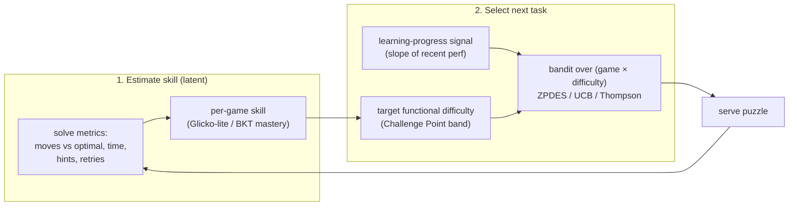

# Optimal Challenge Point (OCP): theory → `pack-it-play-it` mechanics

> Research note + design upgrade for the adaptive engine. Grounds our difficulty/selection
> logic in the learning-science literature, then maps each technique onto concrete mechanics
> this codebase already has or should add. Companion to
> [plans/infinite-adaptive-mode.md](../plans/infinite-adaptive-mode.md) and the shipped
> `src/games/adaptive.ts`.

## What OCP actually is (the formal anchor)

The phrase "Optimal Challenge Point" comes from the **Challenge Point Framework** (Guadagnoli &
Lee, 2004). Its core distinction:

- **Nominal difficulty** — the task's intrinsic difficulty, independent of who's playing. In
  pip this is **problem size** (`difficulty` in `settings.ts`): a 12-node graph coloring is
  nominally harder than a 4-node one, for everyone.
- **Functional difficulty** — difficulty *relative to this learner's current skill and the
  practice conditions*. This is what actually governs learning.

Learning is framed information-theoretically: a task carries *potential information*, but a
learner can only convert it to *learning* if they can process it. **Too easy → no new
information; too hard → can't extract the relevant information.** The **OCP** is the functional
difficulty that maximizes learning while keeping in-practice performance acceptable. It **rises
with skill** — the better you get, the harder the task must be to stay optimal.

> Implication for pip: we should not target a fixed nominal size, nor even a fixed success
> rate. We should target a **functional-difficulty band** that tracks the player's rising
> skill. This is the formal version of vision assumptions **A2** (tunable complexity → flow)
> and **A4** (learning optimal under proper challenge).

This reframes the Bjorks' **desirable difficulties** (New Theory of Disuse: independent
*storage* vs *retrieval* strength — effortful, slightly-failing retrieval is what builds
durable storage). Spacing, interleaving, and retrieval practice are all ways to raise
*functional* difficulty without changing *nominal* difficulty.

## The control problem, two ways

Two complementary control philosophies from the literature:

1. **Target a challenge band** (Challenge Point / DDA): estimate skill, serve difficulty so
   functional difficulty sits in the optimal band. Simple, robust.
2. **Maximize learning progress** (ZPDES — *Zone of Proximal Development & Empirical Success*,
   Clement/Roy/Oudeyer/Lopes): treat each (activity, difficulty) as a bandit arm; reward = the
   *empirical learning progress* it produces (the derivative of performance, not raw success).
   "Generously" reward hard problems the learner *just* succeeds at, keeping them at the **ZPD
   frontier**. Naturally unifies *which game* and *what difficulty* into one selector and
   builds in exploration/exploitation.

pip's current `adaptive.ts` is a crude version of (1) with no skill model. The upgrade is to add
a real skill estimate, then graduate toward (2).

## Technique → mechanic mapping

Status: **✅ shipped · 🔜 planned · ➕ add · ✗ out of scope**

### Instructional design
| Technique | pip mechanic | Status |
|---|---|---|
| **Productive Failure / PS-I** | The box *is* PS-I: struggle on a novel instance first; "Show solution"/`SolverPanel` is the consolidation phase. Make reveal a deliberate two-phase beat. | 🔜 (reframe `SolverPanel`) |
| **Guided discovery / scaffolding** | Faded hints: highlight a constraint, then a cell, then nothing. | ➕ |
| **Scaffolding & fading** | Start novices with smaller size + visible structure; fade as skill rises (adaptive already raises size). | ✅ partial |
| **Error augmentation** | Visually amplify a wasted/illegal move (flash conflicts). Motor-learning-specific; light adaptation only. | ➕ optional |

### Practice & feedback scheduling
| Technique | pip mechanic | Status |
|---|---|---|
| **Interleaving** (contextual interference) | The interleaved scheduler (`scheduler.ts`, `maxRunLength`). This is our main CI lever. | ✅ shipped |
| **Spacing** | Re-surface a previously-seen problem *type* after a delay (spaced re-test) — a scheduler mode. | ➕ |
| **Retrieval practice / testing effect** | Every puzzle *is* a retrieval event; the win-check is the test. Add spaced "recall" repeats. | ✅ / ➕ |
| **Delayed feedback** | Withhold the solved/conflict signal until submit (vs live). Expert mode. | ➕ |
| **Bandwidth feedback** | Only flag errors beyond a tolerance (e.g. > k wasted moves); silence = implicit success. | ➕ |
| **Faded feedback** | High-frequency hints for novices → fewer as the skill estimate rises. | ➕ |

### Computational / algorithmic (the OCP estimator itself)
| Technique | pip mechanic | Status |
|---|---|---|
| **BKT** (Corbett & Anderson 1995) | Per-game/per-skill latent **mastery** via the 4 params P(L₀),P(T),P(G),P(S); unlock harder reduction families past a mastery threshold (~0.95). | 🔜 |
| **POMDP** | Decision-theoretic chooser over actions {harder, easier, hint, space, switch game} under skill+affect uncertainty. Heavyweight; later. | ✗ for now |
| **Multi-Armed Bandit (UCB / Thompson)** | Choose next (game × difficulty) arm balancing exploit (best-known) vs explore. | 🔜 |
| **ZPDES** | MAB whose reward = **learning progress**, biased to hard-but-solved. The recommended target design. | 🔜 |
| **DKT** (RNN) | Sequence model over interaction traces for better next-step prediction. Needs data (MVP5 telemetry first). | ✗ future |

### Psychophysiological / neuroadaptive
| Technique | pip mechanic | Status |
|---|---|---|
| EEG WLI, pupillometry, HRV, GSR | No sensors in a web app. **Behavioral proxies** stand in: solve time, hesitation/idle gaps, error bursts, rage-resets. Webcam pupillometry is a far-future maybe. | ✗ (use proxies) |

## Calibration by skill state (from the recap, operationalized)

| State | Detected by | Adaptive actions in pip |
|---|---|---|
| **Novice / overload** | low skill est., high time, error bursts, resets | de-escalate size; **blocked** practice (raise `maxRunLength`); immediate/high-freq hints; reveal solution sooner |
| **Intermediate / flow** | success near OCP band, steady progress | hold macro-schedule; keep **interleaving**; moderate size variability; spaced re-tests |
| **Expert / underload** | optimal moves, fast, low variance | escalate size; **random/interleaved** high-CI; **fade/delay** feedback; PS-I (struggle before reveal) |

Note the elegant tie-in: **blocked↔interleaved** and **immediate↔delayed/faded feedback** are
exactly the knobs our scheduler + feedback layer expose — so "calibration by skill state"
becomes setting `maxRunLength`, feedback timing, and the difficulty target from the skill
estimate.

## Concrete upgrade path for `adaptive.ts`

Today (`src/games/adaptive.ts`): `optimal moves & ≤30s → +250; mistake or >45s → −250`. A
reasonable DDA bootstrap, but skill-blind and success-targeted, not OCP/learning-progress.

- **Stage 0 (shipped).** Heuristic challenge function on moves+time.
- **Stage 1 — skill model + challenge band.** Add a per-game skill estimate (Glicko-lite from
  [infinite-adaptive-mode.md](../plans/infinite-adaptive-mode.md), or BKT mastery). Convert the
  solve into a continuous **performance score** (already have moves-vs-optimal + time). Drive
  difficulty so *expected* performance sits in the functional-difficulty band (≈ high-but-not-
  certain success), not a fixed step. Pure, unit-testable.
- **Stage 2 — learning-progress bandit (ZPDES).** Track recent performance slope per
  (game, difficulty band). A UCB/Thompson selector picks the next game+difficulty maximizing
  empirical learning progress → unifies the interleaving scheduler and the difficulty knob into
  one OCP-seeking selector at the ZPD frontier.
- **Stage 3 — mastery tracing + feedback scheduling.** BKT mastery gates unlocking harder
  reduction families; faded/delayed/bandwidth feedback driven by the skill estimate; spaced
  re-tests via the scheduler. DKT only once MVP5 telemetry yields enough traces.

Each stage is independently shippable and testable (simulate synthetic learners; assert the
realized challenge band / learning-progress curve — same harness style as the adaptive unit
tests and the vision's simulation-first approach).

## Why this matters for the platform thesis

OCP is the mechanism behind vision assumption **A4** ("learning optimal under proper
challenge") and the engine for **A2** (tunable complexity → flow). A learning-progress selector
(ZPDES) is also the cleanest way to operationalize **A5** (randomized/interleaved → general
learning): interleaving *is* the high-contextual-interference arm the bandit will favor for
intermediate/expert learners. And the per-game skill vector it produces is the measurement
substrate for the **A3 transfer experiment** (MVP3).

## Sources

- Guadagnoli & Lee (2004), *Challenge Point: A Framework…* — [Challenge Point Framework (Wikipedia)](https://en.wikipedia.org/wiki/Challenge_point_framework) · [PDF (ResearchGate)](https://www.researchgate.net/publication/8574634_Challenge_Point_A_Framework_for_Conceptualizing_the_Effects_of_Various_Practice_Conditions_in_Motor_Learning)
- *Measurement of functional task difficulty / optimal challenge point* — [ScienceDirect](https://www.sciencedirect.com/science/article/abs/pii/S0167945715300105)
- Clement, Roy, Oudeyer, Lopes — *Multi-Armed Bandits for Intelligent Tutoring Systems* (ZPDES/RiARiT) — [arXiv:1310.3174](https://arxiv.org/abs/1310.3174) · [JEDM](https://files.eric.ed.gov/fulltext/EJ1115278.pdf)
- Corbett & Anderson (1995) — Bayesian Knowledge Tracing — [What is BKT? (Williams CS)](https://www.cs.williams.edu/~iris/res/bkt/) · [Properties of BKT (JEDM)](https://files.eric.ed.gov/fulltext/EJ1115329.pdf)
- Bjork & Bjork — desirable difficulties / New Theory of Disuse — [Creating Desirable Difficulties (UCLA Bjork Lab, 2011)](https://bjorklab.psych.ucla.edu/wp-content/uploads/sites/13/2016/04/EBjork_RBjork_2011.pdf) · [Introducing Desirable Difficulties (UNH/Bjork)](https://www.unh.edu/teaching-learning-resource-hub/sites/default/files/media/2023-06/itow-introducing-desirable-difficulties-into-practice-and-instruction-bjork-and-bjork.pdf)
- DDA + flow background — see [infinite-adaptive-mode.md](../plans/infinite-adaptive-mode.md) sources (Zohaib 2018; Pelánek; dynamic-K Elo).
